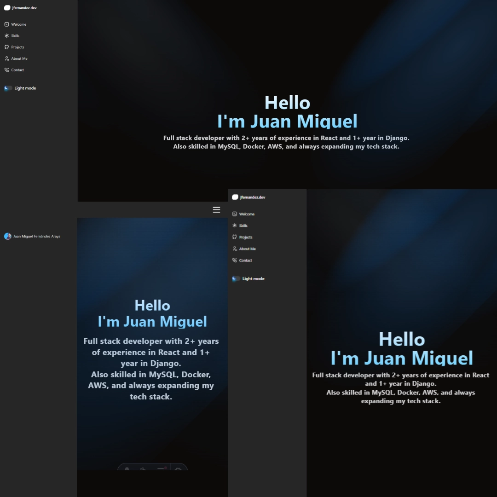

# 🚀 Portfolio Personal - Juan Miguel Fernández

Un portfolio moderno y elegante construido con **Astro**, **React** y **Tailwind CSS** que muestra mis proyectos y habilidades como desarrollador full stack.



## ✨ Características Principales

- ✅ **Diseño Moderno**: Interfaz elegante con efectos de animación y transiciones fluidas
- ✅ **Totalmente Responsive**: Optimizado para móviles, tablets y desktop
- ✅ **Tema Oscuro/Claro**: Toggle de tema con transiciones suaves
- ✅ **Formulario de Contacto**: Integrado con EmailJS y protección anti-spam (Cloudflare Turnstile)
- ✅ **Timeline Interactivo**: Visualización de trayectoria personal y profesional
- ✅ **Galería de Proyectos**: Showcase de proyectos con tarjetas expandibles
- ✅ **Performance Optimizada**: SSG con Astro para velocidad máxima
- ✅ **SEO Friendly**: Meta tags optimizados y estructura semántica

## 🛠️ Stack Tecnológico

### Core
- **[Astro 5.12+](https://astro.build/)** - Framework web moderno para sitios estáticos/SSR
- **[React 19](https://react.dev/)** - Componentes interactivos
- **[TypeScript](https://www.typescriptlang.org/)** - Tipado estático
- **[Tailwind CSS 4](https://tailwindcss.com/)** - Estilos con utilidades

### UI Components & Libraries
- **[Radix UI](https://www.radix-ui.com/)** - Componentes accesibles (Label, Switch, Slot, Tabs)
- **[React Hook Form](https://react-hook-form.com/)** - Manejo de formularios
- **[Zod](https://zod.dev/)** - Validación de esquemas
- **[Motion (Framer Motion)](https://motion.dev/)** - Animaciones fluidas
- **[Tabler Icons](https://tabler-icons.io/)** - Iconografía moderna
- **[Canvas Confetti](https://www.npmjs.com/package/canvas-confetti)** - Efectos visuales

### Integraciones & Services
- **[EmailJS](https://www.emailjs.com/)** - Envío de emails desde el cliente
- **[Cloudflare Turnstile](https://www.cloudflare.com/products/turnstile/)** - Protección anti-spam CAPTCHA
- **[Vercel](https://vercel.com/)** - Hosting y deployment

### Tooling
- **[pnpm](https://pnpm.io/)** - Gestor de paquetes eficiente
- **[Vite](https://vitejs.dev/)** - Bundler y dev server

## 📁 Estructura del Proyecto

```
portfolio-jfernandez-2025/
├── src/
│   ├── components/
│   │   ├── Header/
│   │   │   ├── SidebarHeader.tsx    # Navegación lateral
│   │   │   └── SwitchThemeToggle.tsx # Toggle de tema
│   │   ├── main/
│   │   │   ├── about/
│   │   │   │   └── timeline.tsx      # Timeline personal
│   │   │   ├── contact/
│   │   │   │   ├── contact.astro     # Sección de contacto
│   │   │   │   └── contact-form.tsx  # Formulario con EmailJS
│   │   │   ├── projects/
│   │   │   │   ├── ExpandableCards.tsx
│   │   │   │   └── projectList.astro
│   │   │   ├── skills/
│   │   │   │   ├── explored.tsx      # Tecnologías exploradas
│   │   │   │   ├── proficient.tsx    # Stack principal
│   │   │   │   ├── soft.tsx          # Soft skills
│   │   │   │   └── visual.tsx        # Herramientas visuales
│   │   │   ├── skills.tsx
│   │   │   └── welcome.astro         # Hero section
│   │   └── ui/                       # Componentes UI reutilizables
│   │       ├── animated-testimonials.tsx
│   │       ├── button.tsx
│   │       ├── card-hover-effect.tsx
│   │       ├── form.tsx
│   │       ├── input.tsx
│   │       ├── label.tsx
│   │       ├── sidebar.tsx
│   │       ├── spotlight-new.tsx
│   │       ├── switch.tsx
│   │       ├── tabs.tsx
│   │       ├── textarea.tsx
│   │       └── timeline.tsx
│   ├── hooks/
│   │   └── use-outside-click.tsx
│   ├── layouts/
│   │   └── main.astro              # Layout principal
│   ├── pages/
│   │   └── index.astro             # Página principal
│   ├── styles/
│   │   └── global.css              # Estilos globales
│   └── lib/
│       └── utils.ts                # Utilidades (cn, etc)
├── public/
│   ├── about/                      # Imágenes del timeline
│   ├── eqtickets/                  # Proyecto: Sistema de tickets
│   ├── maba/                       # Proyecto: MABA
│   ├── old/                        # Portfolio anterior
│   └── this/                       # Este portfolio
├── astro.config.mjs                # Configuración de Astro
├── components.json                 # Configuración de componentes UI
├── tsconfig.json                   # Configuración de TypeScript
├── DEPLOYMENT.md                   # Guía de despliegue
└── README.md                       # Este archivo
```

## 🚀 Instalación y Desarrollo

### Prerrequisitos

- **Node.js** 18.0.0 o superior
- **pnpm** (recomendado) o npm

### Instalación

1. **Clonar el repositorio**
   ```bash
   git clone https://github.com/tu-usuario/portfolio-jfernandez-2025.git
   cd portfolio-jfernandez-2025
   ```

2. **Instalar dependencias**
   ```bash
   pnpm install
   ```

3. **Configurar variables de entorno**
   
   Crea un archivo `.env` en la raíz del proyecto:
   ```bash
   # EmailJS Configuration
   PUBLIC_EMAILJS_SERVICE_ID=tu_service_id
   PUBLIC_EMAILJS_TEMPLATE_ID=tu_template_id
   PUBLIC_EMAILJS_PUBLIC_KEY=tu_public_key

   # Cloudflare Turnstile
   PUBLIC_TURNSTILE_SITE_KEY=tu_site_key
   ```

   > **Nota**: Ver [DEPLOYMENT.md](DEPLOYMENT.md) para detalles sobre cómo obtener estas credenciales.

4. **Ejecutar en modo desarrollo**
   ```bash
   pnpm dev
   ```

5. **Abrir en el navegador**
   ```
   http://localhost:4321
   ```

### Scripts Disponibles

| Script | Descripción |
|--------|-------------|
| `pnpm dev` | Inicia el servidor de desarrollo con hot reload |
| `pnpm build` | Construye el proyecto optimizado para producción |
| `pnpm preview` | Previsualiza la build de producción localmente |
| `pnpm astro` | Ejecuta comandos CLI de Astro |

## 🎨 Secciones del Portfolio

### 🏠 Welcome
- Hero section con efectos de spotlight dinámicos
- Texto con animación de escritura
- Call-to-action prominente
- Diseño responsive y moderno

### 💻 Skills
Organizado en cuatro categorías:

#### **Proficient Tech Stack**
Tecnologías con las que tengo experiencia profesional:
- **React** (2+ años) - Next.js, Vite, Astro
- **Django** (1+ año) - REST APIs, ORM
- **Docker** - Containerización y orquestación
- **AWS** - EC2, S3, RDS
- **MySQL** - Diseño y optimización de bases de datos

#### **Explored Technologies**
Tecnologías en exploración:
- React Native, Flask, Laravel
- Unity, Godot
- Android, WordPress

#### **Design & Media Tools**
Herramientas de diseño y prototipado:
- Figma, Adobe Suite
- Canva, etc.

#### **Soft Skills**
Habilidades blandas y metodologías:
- Trabajo en equipo
- Resolución de problemas
- Comunicación efectiva
- Metodologías ágiles

### 📂 Projects
Galería interactiva de proyectos destacados:

1. **EQ Tickets** - Sistema de gestión de tickets para eventos
2. **MABA** - [Descripción del proyecto]
3. **Portfolio Anterior** - Versión previa del portfolio
4. **Este Portfolio** - Portfolio actual con Astro y React

Cada proyecto incluye:
- Imágenes en desktop y mobile
- Descripción técnica
- Stack utilizado
- Enlaces (si aplicable)

### 👨‍💻 About
Timeline interactivo mostrando:
- **Past** - Background y formación
- **Present** - Situación actual y proyectos
- **Future** - Metas y objetivos

Con imágenes y descripciones contextuales para cada etapa.

### 📧 Contact
Formulario de contacto funcional con:
- ✅ Validación en tiempo real con Zod
- ✅ Envío directo a email con EmailJS
- ✅ Protección anti-spam con Cloudflare Turnstile
- ✅ Estados de carga y mensajes de éxito/error
- ✅ Enlaces directos a redes sociales:
  - GitHub: [@9ero](https://github.com/9ero)
  - LinkedIn: [juanmiguelfernandeza](https://www.linkedin.com/in/juanmiguelfernandeza/)
  - Figma: [@midjuan](https://www.figma.com/@midjuan)

## 🔧 Configuración Avanzada

### Variables de Entorno

El proyecto requiere las siguientes variables de entorno públicas (todas con prefijo `PUBLIC_` para Astro):

| Variable | Descripción | Requerido |
|----------|-------------|-----------|
| `PUBLIC_EMAILJS_SERVICE_ID` | ID del servicio de EmailJS | ✅ Sí |
| `PUBLIC_EMAILJS_TEMPLATE_ID` | ID del template de EmailJS | ✅ Sí |
| `PUBLIC_EMAILJS_PUBLIC_KEY` | Public Key de EmailJS | ✅ Sí |
| `PUBLIC_TURNSTILE_SITE_KEY` | Site Key de Cloudflare Turnstile | ✅ Sí |

### Configuración de EmailJS

1. Crea una cuenta en [EmailJS](https://www.emailjs.com/)
2. Configura un servicio de email (Gmail recomendado)
3. Crea un template con estas variables:
   ```
   From: {{fullname}}
   Email: {{email}}
   
   Message:
   {{message}}
   ```
4. Copia tus credenciales al archivo `.env`

### Configuración de Cloudflare Turnstile

1. Ve a [Cloudflare Dashboard](https://dash.cloudflare.com/)
2. Activa Turnstile y crea un nuevo sitio
3. Agrega tu dominio (localhost para desarrollo)
4. Copia el Site Key al archivo `.env`

## 🌐 Despliegue en Vercel

Este proyecto está optimizado para Vercel con el adaptador oficial de Astro.

### Quick Deploy

[](https://vercel.com/new)

### Manual Deployment

Ver la guía completa en [DEPLOYMENT.md](DEPLOYMENT.md) que incluye:
- Configuración paso a paso
- Variables de entorno en Vercel
- Troubleshooting común
- Optimizaciones de producción

**Configuración necesaria en Vercel:**
1. Importa el repositorio desde GitHub
2. Configura las 4 variables de entorno
3. Framework Preset: Astro (detectado automáticamente)
4. Build Command: `pnpm build`
5. Deploy!

## 🎯 Características Técnicas

### Performance
- ⚡ **Lighthouse Score**: 95+ en todas las métricas
- 🎨 **First Contentful Paint**: < 1s
- 📦 **Bundle Size**: Optimizado con code splitting
- 🖼️ **Imágenes**: WebP con fallback a PNG
- 🔄 **Lazy Loading**: Carga diferida de componentes

### Accesibilidad
- ♿ **ARIA Labels**: En todos los componentes interactivos
- ⌨️ **Keyboard Navigation**: Completamente navegable con teclado
- 🎨 **Contraste**: WCAG AA+ en ambos temas
- 📱 **Screen Readers**: Optimizado para lectores de pantalla

### SEO
- 🔍 **Meta Tags**: Completos y optimizados
- 🗺️ **Sitemap**: Generado automáticamente
- 📊 **Structured Data**: Schema.org markup
- 🚀 **Core Web Vitals**: Optimizados

### Seguridad
- 🔒 **CAPTCHA**: Cloudflare Turnstile anti-bot
- 🛡️ **CSP Headers**: Content Security Policy
- 🔐 **HTTPS**: Forzado en producción
- 🚫 **XSS Protection**: Sanitización de inputs

## 📱 Responsive Design

El portfolio está completamente optimizado para todos los dispositivos:

| Breakpoint | Dispositivo | Características |
|------------|-------------|-----------------|
| 320px - 640px | 📱 Móviles | Stack vertical, menú hamburguesa |
| 641px - 1024px | 📱 Tablets | Grid de 2 columnas, sidebar colapsable |
| 1025px - 1440px | 💻 Desktop | Sidebar fijo, grid de 3 columnas |
| 1441px+ | 🖥️ Large Screens | Layout expandido, máximo contenido |

## 🤝 Contribuciones

¡Las contribuciones son bienvenidas! Si encuentras un bug o tienes una sugerencia:

1. Fork el proyecto
2. Crea una rama para tu feature: `git checkout -b feature/AmazingFeature`
3. Commit tus cambios: `git commit -m 'Add some AmazingFeature'`
4. Push a la rama: `git push origin feature/AmazingFeature`
5. Abre un Pull Request

### Guía de Estilo
- Usar TypeScript para todos los componentes
- Seguir convenciones de Astro para archivos `.astro`
- Mantener componentes pequeños y reutilizables
- Documentar funciones complejas
- Asegurar accesibilidad (a11y)

## 📄 Licencia

Este proyecto está bajo la Licencia MIT. Ver el archivo `LICENSE` para más detalles.

## 📞 Contacto

- **GitHub**: [@9ero](https://github.com/9ero)
- **LinkedIn**: [Juan Miguel Fernández](https://www.linkedin.com/in/juanmiguelfernandeza/)
- **Figma**: [@midjuan](https://www.figma.com/@midjuan)
- **Portfolio**: [En vivo en Vercel](https://tu-portfolio.vercel.app)

---

## 🙏 Agradecimientos

- [Astro](https://astro.build/) - Por el increíble framework
- [Vercel](https://vercel.com/) - Por el hosting gratuito
- [EmailJS](https://www.emailjs.com/) - Por el servicio de emails
- [Cloudflare](https://www.cloudflare.com/) - Por Turnstile
- [Radix UI](https://www.radix-ui.com/) - Por los componentes accesibles

---

<div align="center">

⭐ **Si te gusta este proyecto, ¡dale una estrella en GitHub!** ⭐

Made with ❤️ by Juan Miguel Fernández

</div>
