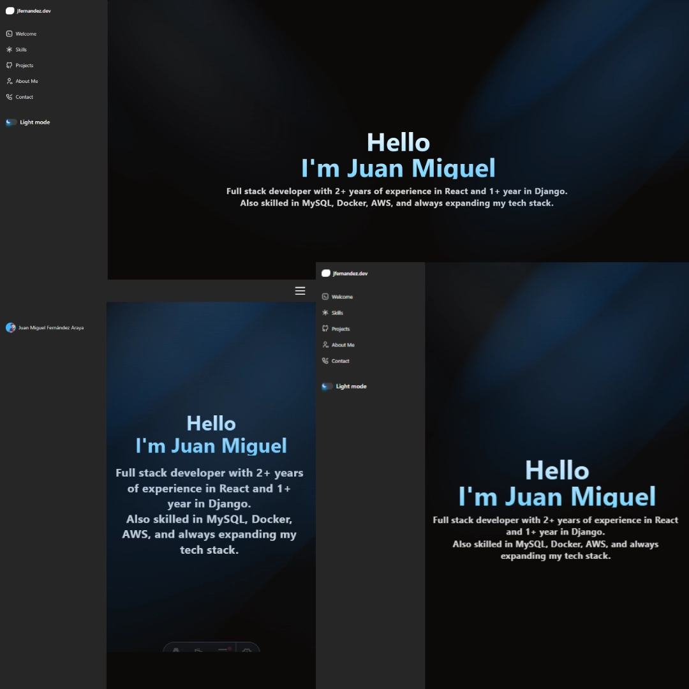

# Portfolio — Juan Miguel Fernández

Portfolio personal construido con Astro, React y Tailwind CSS.



## Stack

- **[Astro 5](https://astro.build/)** — SSR con adaptador Vercel
- **[React 19](https://react.dev/)** — componentes interactivos (islands)
- **[Tailwind CSS 4](https://tailwindcss.com/)** — estilos
- **[TypeScript](https://www.typescriptlang.org/)**
- **[React Hook Form](https://react-hook-form.com/) + [Zod](https://zod.dev/)** — formulario con validación
- **[Cloudflare Turnstile](https://www.cloudflare.com/products/turnstile/)** — protección anti-spam
- **[EmailJS](https://www.emailjs.com/)** — envío de emails (server-side via API route)
- **[Vercel](https://vercel.com/)** — hosting

## Desarrollo local

### Prerrequisitos
- Node.js 18+
- pnpm

### Instalación

```bash
git clone https://github.com/9ero/portfolio-jfernandez-2025.git
cd portfolio-jfernandez-2025
pnpm install
```

### Variables de entorno

Crea un archivo `.env` en la raíz:

```bash
# Cloudflare Turnstile
PUBLIC_TURNSTILE_SITE_KEY=      # necesario en el cliente (widget)
TURNSTILE_SECRET_KEY=           # solo servidor (verificación)

# EmailJS — solo servidor, sin prefijo PUBLIC_
EMAILJS_SERVICE_ID=
EMAILJS_TEMPLATE_ID=
EMAILJS_PUBLIC_KEY=
```

Obtén las credenciales en:
- [EmailJS Dashboard](https://www.emailjs.com/) → tu servicio y template
- [Cloudflare Dashboard](https://dash.cloudflare.com/) → Turnstile → tu sitio (Site Key + Secret Key)

### Comandos

```bash
pnpm dev        # servidor de desarrollo en localhost:4321
pnpm build      # build de producción
pnpm preview    # previsualizar la build localmente
```

## Despliegue

El proyecto usa `output: 'server'` con el adaptador de Vercel. Para desplegar:

1. Importa el repositorio en [Vercel](https://vercel.com/)
2. Configura las 5 variables de entorno en Settings → Environment Variables
3. Framework preset: **Astro** (detectado automáticamente)

Ver [DEPLOYMENT.md](DEPLOYMENT.md) para detalles adicionales.

## Secciones

| Sección | Descripción |
|---|---|
| Welcome | Hero con spotlight y call-to-action |
| Skills | Stack técnico, tecnologías exploradas, herramientas y soft skills |
| Projects | Galería expandible: EQ Tickets, MABA, portfolios anteriores |
| About | Timeline interactivo: pasado, presente y futuro |
| Contact | Formulario con validación, Turnstile y envío server-side |

## Próximos pasos

Ver [ROADMAP.md](ROADMAP.md) para el listado de mejoras pendientes, incluyendo el error activo en el formulario de contacto.

---

**Contacto:**
[GitHub @9ero](https://github.com/9ero) · [LinkedIn](https://www.linkedin.com/in/juanmiguelfernandeza/) · [Figma @midjuan](https://www.figma.com/@midjuan)
